# Homework 5: Road Generation

## Stephanie Goldberg - slgold
- Demo: https://slgold95.github.io/hw05-road-generation/

## References
- Noise: Class slides https://docs.google.com/presentation/d/e/2PACX-1vQAK1Xeb7GGqLoDFz_iu9JuXMb-qE9jqKbZDkrXNSybXweqeIn3xvv4LMxetcM9GEugoU0Q0Ft1qUH-/pub?start=false&loop=false&delayms=60000&slide=id.g4cae677c4f_0_852 and Book of Shaders for FBM and Worley Noise
- [Procedural Modeling of Cities](proceduralCityGeneration.pdf)
- Line Intersection: https://docs.google.com/presentation/d/e/2PACX-1vSXHVq2CajrWQT_OG0RULdZttOFukc8CMHGMe6Jt9mGOI5lpDoomY9PGJHoiZPq2U_32Uy_SzpXDSk-/pub?start=false&loop=false&delayms=60000&slide=id.g1e1b90fa28_0_451 and https://stackoverflow.com/questions/563198/how-do-you-detect-where-two-line-segments-intersect
- Rendering to a Texture: http://www.opengl-tutorial.org/intermediate-tutorials/tutorial-14-render-to-texture/

## 2D Maps
- When you first load the project, you are shown a basic land and water view.
- Green coloring is for the land, and blue is for the water.
- 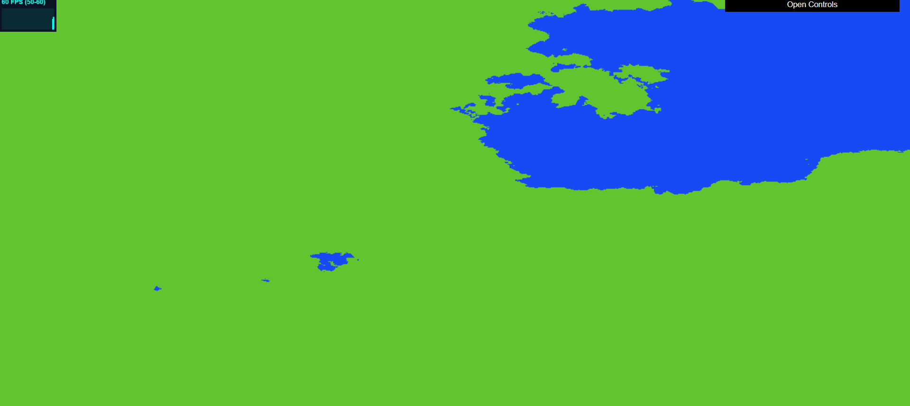
- Check box to see the Terrain Elevation Map: created with FBM and random functions
- 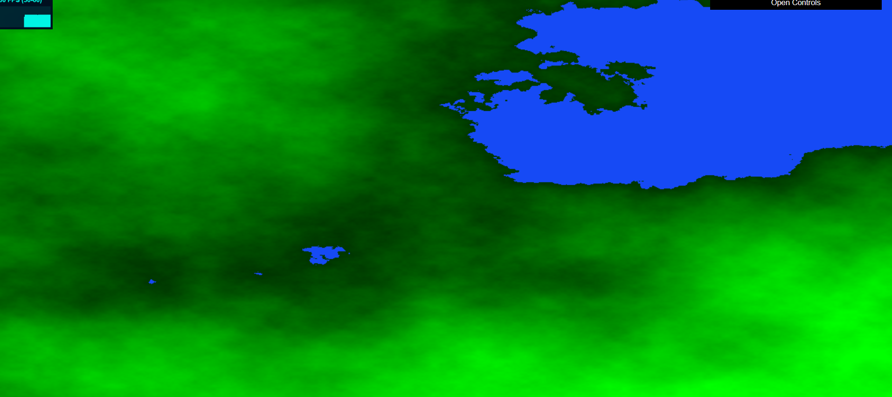
- Check box to see the Population Density Map: created with Worley Noise
- 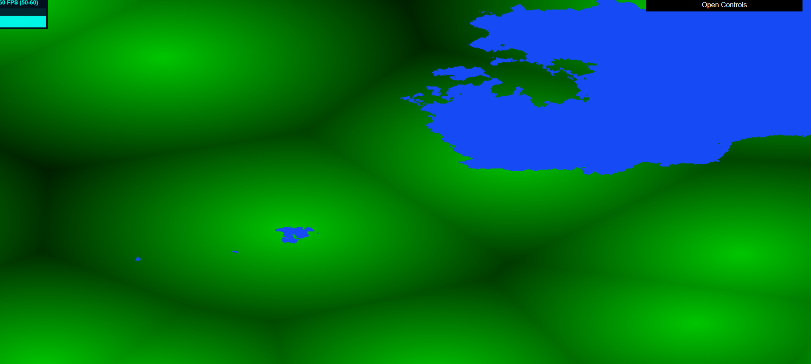
- Check both boxes to have Terrain Elevation and Population Density displayed at the same time:
- 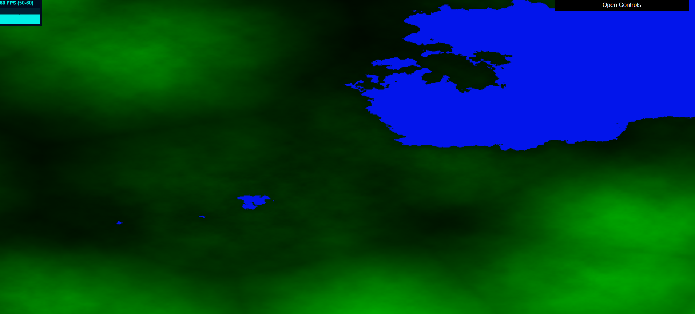
- Lighter coloring is for higher elevations
- Lighter coloring is for more densely populated areas
- Terrain Elevation and Population Density noise rendered to a texture: Would be used to guide the branching of roads from the highways (currently unsuccessful)
- 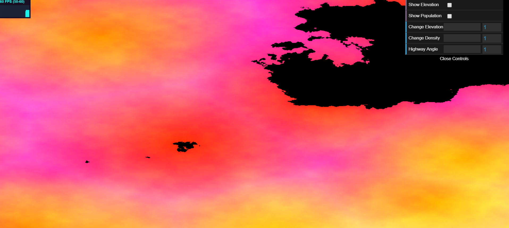
  
## New Pseudo L-System Classes
- Point: Class used to contain the position data for a point. Contains a method used for determining proximity of other points.
- Edge: Class used to define edges. Uses points. Has information about if it is a highway or not, used for drawing different sized roads.
- HTurtle: Turtle class used to expand the highways out. Each turtle has a direction to move in, an up vector, a right vector, a destination point that it will pursue, a point for keeping track of it's own position, a quaternion for the rotation, and arrays to store edges and points.
- LSystemHighway: Initializes and expands HTurtles to create the highway structure. Starts from bottom right-ish area of the screen and grows outward. Contains stack of turtles, array for points, and array for edges to grow the highways.
- NoiseFuncs: Used for noise calculations on the CPU to determine position of turtles (currently not being used correctly).

- Notes: The Highways do cross the water. Had major issues getting roads to branch from highways and creating complex highways, only have very basic highways. Trouble getting an interaction between the texture created and the existing highways. With more time, could hopefully have worked it out. From there, the roads would branch out of the highways and would be influenced by the population density and elevation of the map.

## Tunable GUI Parameters
- Change Terrain Elevation - make the elevation higher as the slider value increases
- 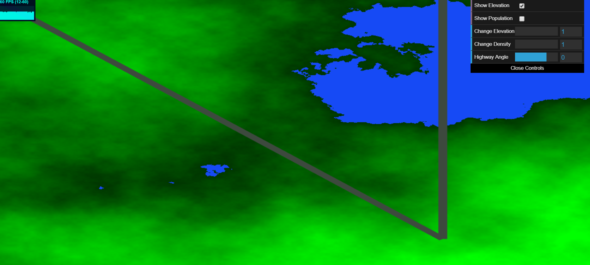
- 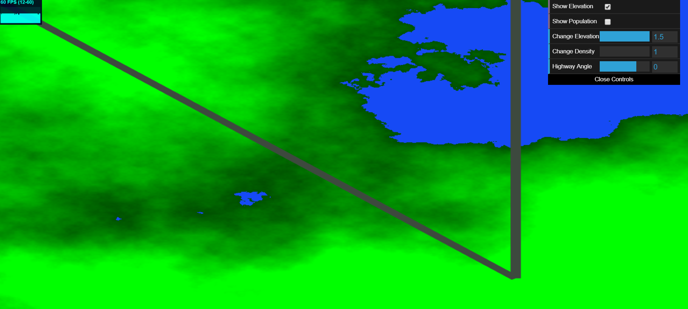
- Change Population Density - make the population density increase as the slider value increases
- 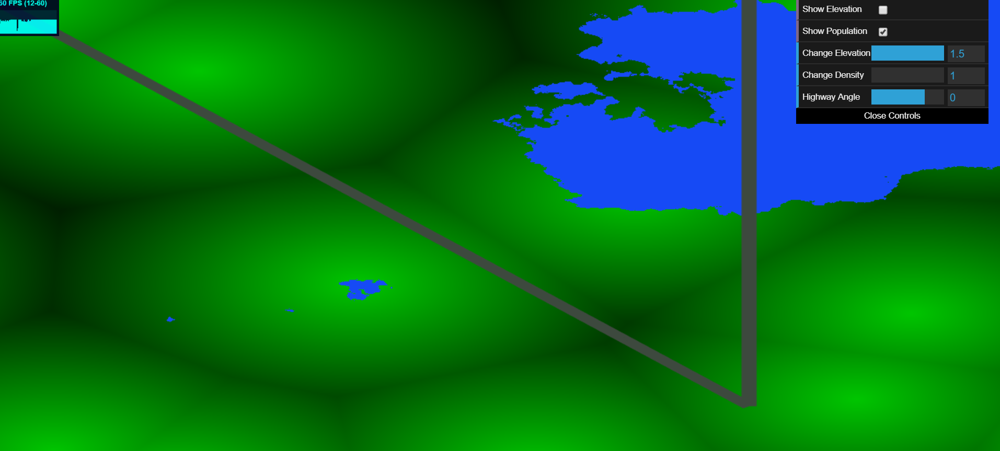
- 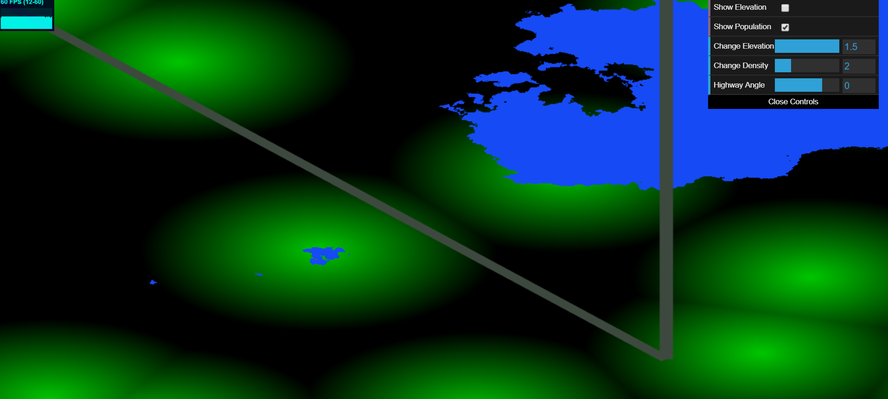
- 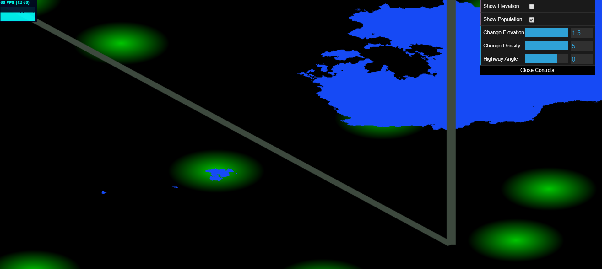
- Change Highway Angle
-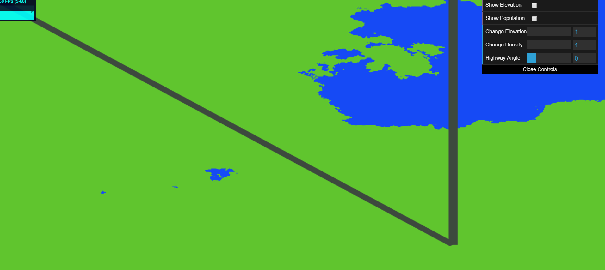
-

