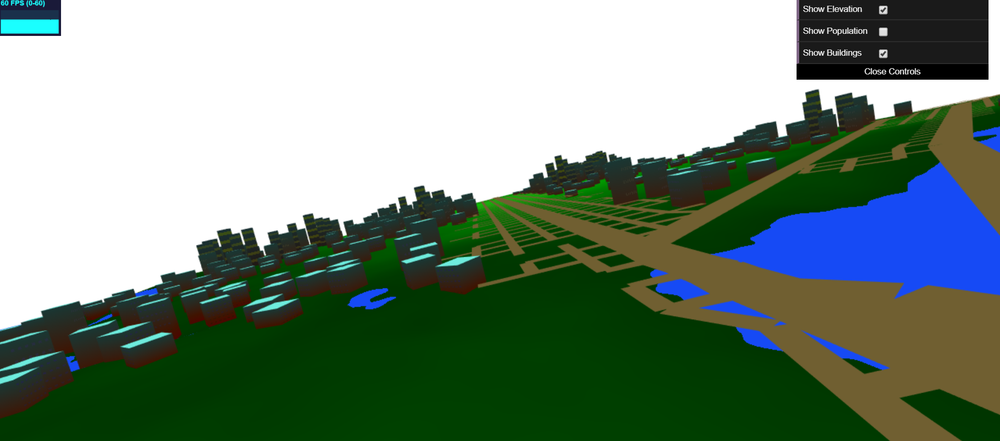
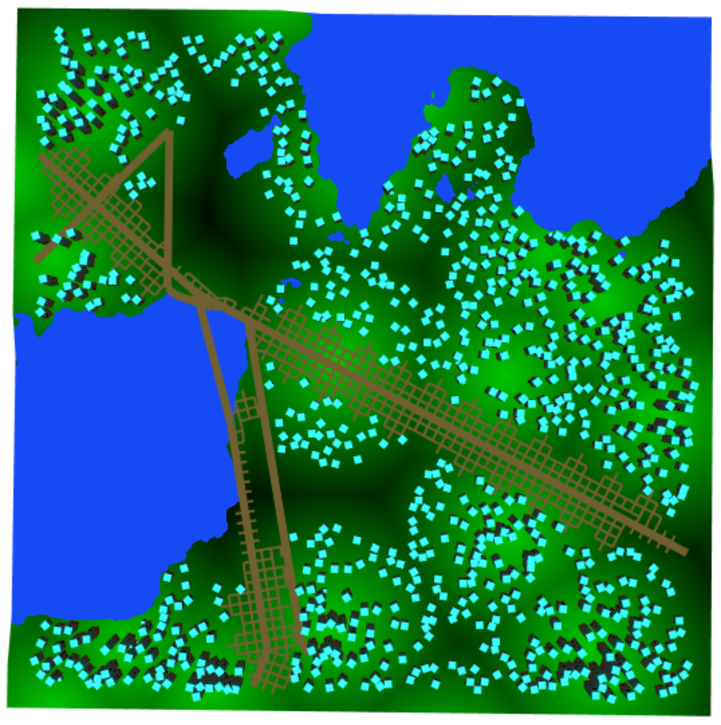

# Homework 6: City Generation

## Stephanie Goldberg - slgold
- Demo: https://slgold95.github.io/hw06-city-generation/
- Be sure to scroll out a bit from the initial camera position, and orient yourself to be looking down.
- 
- 
- 

## References
- Noise: Class slides https://docs.google.com/presentation/d/e/2PACX-1vQAK1Xeb7GGqLoDFz_iu9JuXMb-qE9jqKbZDkrXNSybXweqeIn3xvv4LMxetcM9GEugoU0Q0Ft1qUH-/pub?start=false&loop=false&delayms=60000&slide=id.g4cae677c4f_0_852 and Book of Shaders for FBM and Worley Noise
- [Procedural Modeling of Cities](proceduralCityGeneration.pdf)
- Line Intersection: https://docs.google.com/presentation/d/e/2PACX-1vSXHVq2CajrWQT_OG0RULdZttOFukc8CMHGMe6Jt9mGOI5lpDoomY9PGJHoiZPq2U_32Uy_SzpXDSk-/pub?start=false&loop=false&delayms=60000&slide=id.g1e1b90fa28_0_451 and https://stackoverflow.com/questions/563198/how-do-you-detect-where-two-line-segments-intersect
- Rendering to a Texture: http://www.opengl-tutorial.org/intermediate-tutorials/tutorial-14-render-to-texture/
- Emily's [City Forgery](http://www.emilyhvo.com/city-forgery/) project for inspiration
- IQ's lighting: [IQ's article on artistic lighting](http://iquilezles.org/www/articles/outdoorslighting/outdoorslighting.htm)

## 3D Plane for Terrain
- Change in the plane's elevation at water areas. There is a small slope between the land and water, with the water existing at a lower elevation than the land.
- On the lefthand side of this image you can see where the land sinks down into the water:
- 

## Roads
- The instance rendered roads are drawn .1 in the y direction higher than the plane so they exist on top. They are created from square geometry.
- Highways and roads above the terrain:
- 

## 2D Grid, Points, and Buildings
- 2D Grid created on CPU used to "rasterize" roads in the grid. Keeps track of cells in which a building can or cannot be built. Open spaces are good to build on, but water, roads, and highway areas are not. 
- Created a collection of randomly scattered 2D points within the 2D grid used for building placement. No points are allowed in cells that are already occupied by water, roads, or highways.
- Building geometry based on [Real-time Procedural Generation of 'Pseudo Infinite' Cities](procedural_infinite_cities.pdf). Starting with cube geometry and a defined height, select a corner and lower the whole cube down to create a lower level of the building. "Grow" downwards, and decrement the height value, until the height value becomes negative (less than 0) then halt building "growth".
 

## Procedural Buildings
- The higher the population density is in the city, more (and taller) buildings are created there. On the outskirts of city hub areas, less and smaller buildings exist.
- Building textures utilize noise functions. Going for a stylized city-esque aethestic, I also had buildings appear to change color with the day/night cycle of the sky.
- Worley Noise used to determine population density:
- 
- Three types of buildings: Houses, Residential Buildings, and Skyscrapers.
- Small homes have two windows and are 2 stories maximum height.
  + Small Homes:
  +  
- Residential buildings contain small windows to resemble the appearance of apartment buildings, and are multiple stories high.
- Skyscrapers contain floor-wide windows to resemble office spaces and are the tallest buildings.
  + Residential buildings in the foreground and Skyscrapers in the background:
  +  

## Lighting
-  Multiple directional light sources and lambertian shading were used to ensure that there are no black faces on the buildings.
- Procedural sky background that includes clouds, made with FBM and noise. Changes from morning to sunset time on a cycle. The lights in the windows of the buildings turn on and off with the day/night cycle. (The camera needs to be positioned just above the terrain without any wild rotation to keep the cloud horizon in view).
- 
- 
- 

## GUI Options
- Checkboxes to Show Terrain Elevation, Population Density, and both Terrain Elevation and Population Density
- Rendering the Buildings can be turned on and off:
- 
- 
